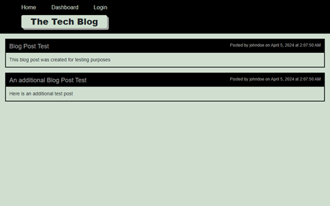

# Tech Blog 
## Description
A full-stack blog application that allows users to view posts and comments. If a user signs up, they also have the ability to add, edit, and delete their own posts.
## Table of Contents
- [Installation](#installation)
- [Usage](#usage)
- [Contributing](#contributing)
- [Tests](#tests)
- [Questions](#questions)
- [Credits](#credits)
- [License](#license)
## Installation
To install this project, clone the repository to your local machine.
## Usage
As a developer - Install the project, open your console, and run the command "npm i". Open your mysql shell and run the command "SOURCE db/schema.sql". Exit the mysql shell and in your terminal run the command "npm run seed" followed by "npm run dev". After this, you can click [here](http://localhost:3001) to view the project.

Alternatively, to interact with the app as a user, you can visit [this Link](https://jm-tech-blog-fe718f2a2321.herokuapp.com/).

The app should resemble the following image:

## Contributing
1. Fork the repository 
 2. Create a new branch for your contribution 
 3. Make your changes and commit them 
 4. Push your local branch to the remote repository and submit a pull request
## Tests
There are currently no tests for this application.
## Questions
You can find my GitHub profile [here](https://www.github.com/JoshMassa). 

If you have any questions, you can email me by clicking [here](mailto:joshuamassapelletier@outlook.com).
## Credits
[Handlebars Docs](https://handlebarsjs.com/guide/#what-is-handlebars) 
[Additional Handlebars Docs](https://www.npmjs.com/package/express-handlebars) 
[Bcrypt Docs](https://www.npmjs.com/package/bcrypt)
## License
This project is covered by &nbsp;&nbsp;